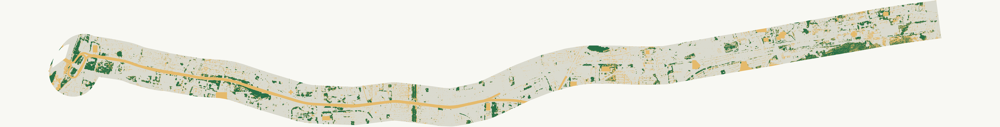

# 市民大道全線綠覆判讀

範圍：市民大道全段，軸線兩側各 250 公尺，含西端分支。EPSG:3826 等比例計算；OSM 推定軸線，並非地籍或測量道路境界。研究區 **5.978 平方公里**。

| 全研究區分母 | 面積 | 比例 |
|---|---:|---:|
| 模型判讀植被 | 619,410 m² | 10.36% |
| 待核實 | 914,165 m² | 15.29% |
| 模型判讀其他 | 4,444,192 m² | 74.35% |

**10.36% 是已標繪候選植被占比，不能當成現況總綠覆率。** 待核實面積沒有算成零綠覆；模型亦有漏判與誤判，因此此比例不是保證下限。綠色為候選植被、土黃色為待核實、灰色為其他。全線原始向量保留 1 m 分類網格邊界；概覽 SVG 是 10 m 色彩彙整，不能用來量測小植栽。

## 全線完成的工作

13 幅連續航照原圖及分類疊圖已逐幅檢查；分段面積加總一致，軸線接縫已修正，全部研究區在影像輸出範圍內。判讀包含校園、商業建築周邊、院落、道路植栽與未開發地，沒有用公園用地界線排除其他植被。

全線呈現大面積綠塊與細碎街道、院落植栽並存；東段可見較連續的南側植被，中央密集街區主要依賴局部公園、校園及街道樹列。這是影像空間分布的描述；尚不能據此推論開放性、步行遮蔭或居民可使用程度。橋下與陰影區是本次最需要另測的部分。

## 方法與來源

- [臺北歷史圖資](https://historygis.udd.gov.taipei/uddweb/)：114 年版航測影像，輸出像元 1 m；版次不等於逐幅曝光日期。13 幅來源影像留在本機，不再散布。
- [Sentinel-2 L2A](https://registry.opendata.aws/sentinel-2-l2a-cogs/)：篩選六個日期，採用 2026-06-03 的 S2B_51RUH_20260603_0_L2A 紅光與近紅外光。原生 10 m。earthsearch:boa_offset_applied=true，因此不再次扣除 0.1。NDVI 作光譜特徵，不直接把閾值像元比例稱為綠覆率。
- RGB 加 NDVI 模型分數 ≥0.65 標為植被，≤0.35 標為其他，其餘待核實。分數不代表校準後機率；暗像元、缺值、模糊化、材質不明運動場及橋梁近似遮蔽帶另外遮罩。
- 高架遮蔽帶使用 OSM 高架中心線兩側各 12 m，是篩查用近似值，並非實测橋面輪廓。樹冠與地被平面重疊只計一次；立面綠化不轉成水平面積。
- [Meta CHMv2](https://registry.opendata.aws/dataforgood-fb-forestsv2/) 僅作高度與歷史參考；本區來源影像為 2018-03-23、2018-08-07。≥2 m 歷史冠層占比 10.20%，不可與本次結果直接相減解釋增減。來源 CC BY 4.0，© Meta / World Resources Institute 資料貢獻者；道路 © OpenStreetMap contributors。

## 品質與限制

117 個分層抽樣目視參考點中，107 個可解讀，10 個模糊點排除驗證。留一影像分區交叉驗證的未加權正確率 93.46%、植被精確率 91.67%、召回率 81.48%。這是小樣本影像判讀驗證，不是面積加權精度或現地真值；驗證二元分類閾值與最終保留疑義區的雙閾值規則不同。早期純 RGB 分類已淘汰。

2025 年版航照與 2026 年近紅外資料混用，施工及植栽變動可能造成不一致。全線遙測篩查已完成，但橋下、私有遮蔽區、模糊化影像及部分材質仍未能確認，不能宣稱全線現地核實完成。詳見 IMAGE_REVIEW.md 與分類資料。

## 檔案

- [完整向量 SVG（gzip 壓縮，解壓後使用）](full-line-results/full-corridor-screening.svg.gz)
- [概覽 SVG](full-line-results/overview.svg)
- [分段統計](full-line-results/panels.json)
- [總統計](full-line-results/summary.json)
- [驗證紀錄](visible-cover/fusion-validation.json)
